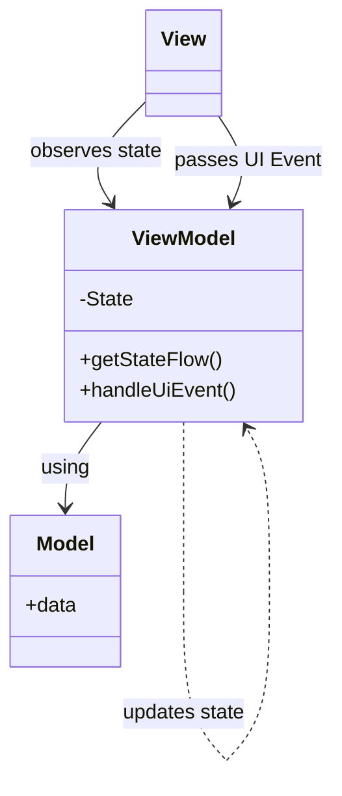

## Evolution

There is a clear direction in presentation patterns evolution - less coupling.
In MVC elements were pretty close to each-other, with a lot of direct interactions. MVP was fixing it with introducing boilerplate interface structure. It's finally possible to test some interactions without using UI (it sounds a bit odd when talking about presentation patterns, I admit). There are still some issues, like keeping the view state, or artificial view lifecycle awareness in MVP.
Does the `Model-View-ViewModel` pattern solves them?

## View-View-What?

`Model-View-ViewModel` (MVVM) is a design pattern that originated from Microsoft's WPF (Windows Presentation Foundation) framework and gained popularity in Android development due to its effectiveness in managing UI-related concerns. MVVM was conceived as an evolution of the traditional MVC (Model-View-Controller) pattern, tailored specifically for the requirements of modern UI development.
Role of Model and View didn't change since `MVP`, or even `MVC`. The biggest practical change in `ViewModel` approach is actually not mentioned in the patterns name. It's the `State`, and how it's used.



### State

That's a very serious name for a fairly simple concept. It's a container for data, that `View` needs to display. `State` will have fields for text input values, booleans controlling button display or not, lists of items to show in UI, etc.

```kotlin
data class State(
    val items: List<Int> = emptyList(),
    val inputError: String? = null,
    val currentInput: String? = null,
    val isLoading: Boolean = false
)
```

How is that different from `View` itself? Well View typically doesn't have a single place for all data that it is using. Data is scattered over multiple fields or arguments, and doesn't create a consistent state. In MVC or MVP, `View` elements are changed independently, so the `Controller` or `Presenter` needs to be aware of how to set up the `View` to represent a particular state.

In MVVM the philosophy is a bit different.

### ViewModel

OK, so how exactly `ViewModel` manages state? For starters, the `State` is immutable. We don't want multiple places updating it without synchronisation.

Wait, how to change immutable state then?

**Don't.**

Create new one instead, using the "old" one. And push it to some flow, observed by the `View`. You may want to have one private mutable flow, so `ViewModel` can freely update current state, and one immutable version of it, so the observer won't be able to change the flow "on accident" :)

Like this:

```kotlin
private val _state: MutableStateFlow<State> = MutableStateFlow(State())
val state: StateFlow<State> = _state
```

How to update `State`?
Take current version of state, change whatever is needed and push it to the flow. Like that:

```kotlin
_state.update { currentState ->
    currentState.copy(inputError = exception.message)
}
```

This way, when there will be another update of the `State`, it will (or at least have possibility to) take the last state into account, avoiding race conditions, and having state created from merging multiple partial updates.

The `ViewModel` have absolutely no relationship with `View` - it's awesome :) All it does is generating new states, based on data or events from the `Model`.

#### Testing

IMO the best perk of using `MVVM` - its insanely easy to test. `ViewModel` has no Android or UI knowledge, all it does is react to UI events and produce new `State`. Perfect black box :) Most tests will look like:

1. Setting system under test (model data, initial state)
2. Passing UI event
3. Checking if state update is as expected

And that's it.

#### Lifecycle awareness

One of the issues with `MVP` was that `Presenter` didn't really know when the `View` is displayed or destroyed, and could produce UI changes when they were no longer needed. Typical solution was to add methods for `attatchView` and `detatchView`, and remember to tie everything together.

`ViewModel` solves it naturally with `viewModelScope`. From documentation:
> This scope will be canceled when ViewModel will be cleared, i.e ViewModel.onCleared is called.
>
>This method will be called when this ViewModel is no longer used and will be destroyed.
> It is useful when ViewModel observes some data and you need to clear this subscription to prevent a leak of this ViewModel.

So even `ViewModel` doesn't have any connection with `View` it will be notified when it's no longer needed.

#### Databinding

Back in a day of `XML` views there was a way to create stream of updates to `View` elements, it was called **Databinding**. It allowed you to *bind* the *data* from the `Model` to the UI element, without need to expose separate methods in `View` for each element and call it each time something changed in the Model. There were some native ways of achieving that, I think also some Rx libs - I was never a fan of a direct connection between `Model` and a `View` with some facilitation done in between.

Currently IMO, in 2024 (when I write this), with Jetpack Compose, there is no place for it. Using `StateFlow` with fairly simple `State` object that is used by `@Composable` function to create UI is **sooooo much easier**. I'm not even sure if you can do databinding with Jetpack Compose... probably with multiple streams of data, separately for each UI element you want to bind.

I do not recommend trying, just use Jetpack Compose, single `State` flow and fell in love with `@Preview` annotation.

### View

The `View` on the other hand, has reference to the `ViewModel`, because it needs to observe the `State` and send UI events to it.

On every new `State` that the `View` collects, the UI is redrawn, to represent current state generated by `ViewModel`. **The `State` is the only source of truth**, `View` should not keep data on its own and then compile it with state change to decide what to display.

Same goes for the logic, everything should be encapsulated in the `ViewModel` (regarding handling UI) and `Model` (business logic).

#### UI Events

The `View` has to notify `ViewModel` about UI interactions. It can be done with just calling `ViewModel` public methods, since `View` has reference to it.
So `ViewModel` can expose method like:

```kotlin
fun addButtonClicked() {
    viewModelScope.launch {
        ...
    }
}
```

And the `View` will just call it:

```kotlin
Button(
    onClick = {
        addButtonClicked()
    },
)
```

But this won't scale nicely. The `ViewModel` methods will also have a lot of common code handling `viewModelScope` and potential errors and state updates.

Cleaner way is to make `ViewModel` handling events within single public method.

```kotlin
sealed class Event {
    data object AddButtonClicked : Event()
    class InputChanged(val input: String) : Event()
    class RemoveItem(val item: Int) : Event()
}

------
// Inside ViewModel:        
fun handleEvent(event: Event) {
    when (event) {
        Event.AddButtonClicked -> addButtonClicked() // calling private method
        is Event.InputChanged -> inputChanged(event.input)
        is Event.RemoveItem -> removeItem(event.item)
    }
}
```

In general, all UI events should be sent to `ViewModel`, so it can decide what to do with them, and update `State`.
But there can be exceptions, and there is a nice graph from https://developer.android.com/topic/architecture/ui-layer/events to illustrate why sometimes is OK to have some logic in View.


Another thing to consider is: should `ViewModel` do ALL of UI logic, or come more trivial things be handled by the `View` itself. When using `Jetpack Compose` it's tempting to put some logic in `@Composable` function, because it's Kotlin code, just like in `ViewModel`. I usually tend to follow similar decision tree as the above.
For example: if the `State` contains list of items, but in the UI needs to show number of items, I would leave that in the `View`, without creating another `State` field that would just count elements on the list, each time the list is updated. Similar case is filtering elements on the list, without changing the list itself. But when filtering gets complex, and you want to test it, it might be better to put it in `ViewModel`. So it all kinda depends on the case, but rule of thumb for me is to keep everything in `ViewModel`, unless it's trivial UI data that does not ever interfere with the `State`.

#### Side effects

Should every single thing on the UI be displayed by updating the `State`? Well... not really. We have temporary UI elements like `Snackbar` or `Toast`, that will disappear after short time, and usually represent just information that something happened, like error or success. And while it may be important for the `State` to be aware if error was displayed, or is not displaying anymore (to not display the same one twice or something) it usually is **shoot-and-forget** type of event, with no expected action from the user.

Events like that are called `Side Effects`. They may handled as another stream observed by the `View`:

```kotlin
sealed class SideEffect {
    class ShowError(val text: String) : SideEffect()
    class ShowToast(val text: String) : SideEffect()
}
---
// inside ViewMode:
private
val _sideEffect = Channel<SIDE_EFFECT>(Channel.BUFFERED)
val sideEffect: Flow<SIDE_EFFECT> = _sideEffect.receiveAsFlow()
---
// inside View:
lifecycleScope.launch {
    lifecycle.repeatOnLifecycle(Lifecycle.State.STARTED) {
        launch {
            viewModel.sideEffect.collect {
                handleSideEffect(it)
            }
        }
    }
}
```

Notice that for `Side Effects` I used `Channel` rather than `MutableStateFlow`. Since I don't have any initial side effect to put in the stream, or I don't even want to keep any event there if observers join later, using `Channel` sounds like better fit than `StateFlow`.

#### Previews

Using `State` as an input to `@Composable` method makes creating Jetpack Compose previews as easy as it can get. When splitting `View` into smaller `@Composables` you may want to pass just required data fields from whole `State` to make them less dependent on changes. This promotes having nice small methods generating UI, and is easy to see the result in IDE, verifying multiple value variants (long numbers, long text, dark mode, etc.) without building the app.

### Unidirectional dataflow

This phrase often pops when talking about `MVVM`. But what it means? That data flows in single direction :) But there may be multiple flows of data, and the Producer may also be an Observer of some other flow. But it't the flow that is the only communication interface. The `View` is not exposing methods to set its elements, its observing the `State`. The `ViewModel` is not exposing its internal methods but is waiting for UI Events to perform some operations and update the `State`. No callbacks, no waiting for the response. Just sending events one way and waiting for `State` update.

[More info in Android Developer Portal](https://developer.android.com/jetpack/compose/architecture)

### Model

It is exactly the same as for `MVC` and `MVP`, holds business logic in whatever form is suitable for your case. `ViewModel` is handling only UI logic, and anything not-related to UI should be part of domain model code.

## Advantages of MVVM

**Encapsulation**: Each layer in MVVM is responsible for specific aspects of the application's functionality. The model handles data and business logic, the view manages UI components and layout, and the view model orchestrates the interaction between the model and the view. This clear separation makes it easier to understand and maintain the codebase.

**Modularity**: MVVM encourages modular development, allowing developers to focus on implementing and testing individual components independently. This modularity makes it easier to add new features, fix bugs, and refactor existing code without affecting other parts of the application.

**Isolation of Concerns**: The separation of concerns in MVVM makes it easier to write unit tests for each component in isolation. Developers can write tests for the view model layer without needing to interact with the view or the model directly, leading to more focused and efficient testing.

**Mocking and Dependency Injection**: MVVM simplifies the process of mocking dependencies and injecting test doubles into unit tests. View models can be tested with mock data sources or repositories, allowing developers to simulate different scenarios and edge cases easily.

**Reduced Boilerplate Code**: MVVM reduces the amount of boilerplate code required for UI-related tasks by leveraging features like data binding and Android Architecture Components. This reduces the cognitive overhead of writing and maintaining tests, making it easier to ensure code quality and reliability.

**Lifecycle Awareness**: ViewModel, a Jetpack component, is lifecycle-aware and automatically handles configuration changes and lifecycle events in Android activities and fragments. This simplifies the management of UI state and prevents memory leaks.

## Conclusion

Considering the benefits MVVM brings to Android development, it is strongly recommended as the de facto pattern for most scenarios. Its clear separation of concerns helps in maintaining a clean and organized codebase, making it easier to understand, extend, and debug. The enhanced testability and maintainability offered by MVVM streamline the development process, allowing for faster iterations and higher code quality. Moreover, the seamless integration with Android Jetpack components and support for reactive programming paradigms make MVVM well-suited for modern Android app development, enabling developers to build responsive, scalable, and maintainable applications.
