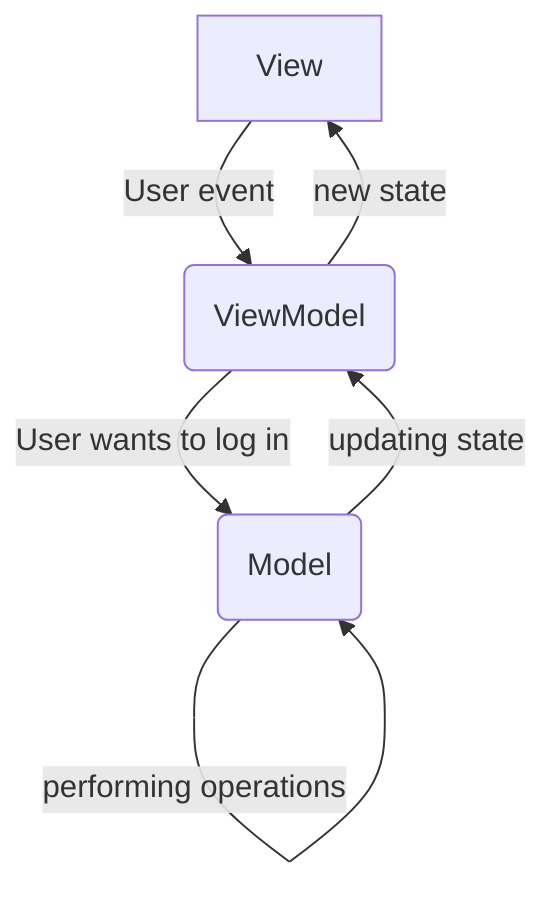
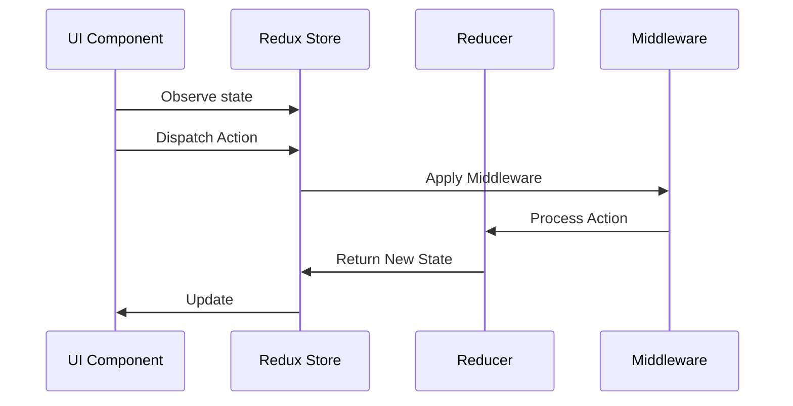

> I already covered [MVC](https://asvid.github.io/2024-01-27-MVC), [MVP](https://asvid.github.io/2024-01-29-MVP), and [MVVM](https://asvid.github.io/2024-02-09-MVVM). But...

## There is another

Just as you could think that `MVVM` is already at least good enough, if not perfect, for the majority of cases, I present you yet another MV-whatever architecture. But there is a twist. This one, the `Model View Intent` is not as concrete as all previously mentioned. IMO it is more of a spectrum. It starts with basic `MVVM` with an event/action communication flow, and ends in `Redux` global app state rendering. With some feature or module local state store, but borders are fluid.

OK but what is the `Intent`? Forget about Android `Intent` class, it has nothing to do with it. In this pattern it's an abstraction over event or action. User clicked a button? Well probably with some intention, like "log me in" or "delete my account". Your phone discovered a new Bluetooth device? It's an event, that may result in `pair new device` intent.

In general, the intent originates in the `View` (but doesn't have to, it can be a background event or push for example), is sent to the `Model` that processes it, then the state is updated and the `View` gets new data to display.



But how is that different from MVVM?

## MV(VM)I

Often in `MVVM` you will have `View` calling `ViewModel` methods directly. Like described in my [previous post](https://asvid.github.io/2024-02-09-MVVM#ui-events). But View can also send events declared by ViewModel to a single contact method, also described in that post. That's like level 0 of MVI, just `MVVM` using events for View->ViewModel communication.

You may quickly notice that in every single `ViewModel` you have a lot of boilerplate code. Handling state, running a coroutine in `viewModelScope` etc. It can all be extracted, so the `ViewModel` can actually focus on handling its job, without obfuscating it with all that boring stuff. I found great video walking you through the whole process, not just showing the result:

[How to write your own MVI system and why you shouldn't](https://www.youtube.com/watch?v=E6obYmkkdko)

The title suggest to not do it manually and rather use one of available libraries. I would agree on that, there are some libraries that would handle everything for you. But I also think it's very important to understand how it works under the hood.

### The Container

The place where you put all the boring stuff is `Container`. It holds the `STATE` and can post `SIDE EFFECTS`, so events that don't change the state, but should be handled by the View somehow. In this implementation, `Container` performs `STATE` alterations, based on logic set in `ViewModel`, within a coroutine scope also set by `ViewModel`. But notice that `ViewModel` IS NOT a `Container`, VM just uses it. **Composition over inheritance!**

Events, Side Effects, and the State, are still declared by ViewModel. This is to minimize their scope, they are not for handling global events, just for handling stuff relevant for this particular portion of the User Interface. When there is more global event happening, it shouldn't be handled by any particular ViewModel, but rather all interested ViewModels should observe relevant change in the `Model`.

```kotlin
// UI will display this:
data class State(
    val items: List<Int> = emptyList(),
    val inputError: String? = null,
    val currentInput: String? = null,
    val isLoading: Boolean = false
)

// UI will observe those:
sealed class SideEffect {
    class ShowError(val text: String) : SideEffect()
    class ShowToast(val text: String) : SideEffect()
}

// and UI will send those:
sealed class Event {
    data object AddButtonClicked : Event()
    class InputChanged(val input: String) : Event()
    class RemoveItem(val item: Int) : Event()
}
```

The View Model code:

```kotlin
class ViewModel : ViewModel() {

    val container = Container<State, SideEffect>(viewModelScope, State())
    ...
```

Handling UI events with the only public method in ViewModel:

```kotlin
fun handleEvent(event: Event) {
    when (event) {
        Event.AddButtonClicked -> addButtonClicked()
        is Event.InputChanged -> inputChanged(event.input)
        is Event.RemoveItem -> removeItem(event.item)
    }
}
```

If you are thinking about logging user actions, this may be the place to do it.

Events are handled like that:

```kotlin
private fun removeItem(item: Int) = container.intent { // this block implements logic of changing the state
    showLoading() // calling another method that uses container
    Model.removeItem(item)
        .onSuccess { hideLoading() }
        .onFailure { error ->
            hideLoading()
            container.postSideEffect(SideEffect.ShowError(error.message.orEmpty())) // using side effect
        }
}

private suspend fun showLoading() {
    container.reduce { // reduce means take the current STATE, and produce new one from it
        copy(isLoading = true) // actual state changing logic
    }
}

private suspend fun hideLoading() {
    container.reduce {
        copy(isLoading = false)
    }
}
```

The equivalent in more traditional MVVM would be

```kotlin
    private fun hideLoading() {
    viewModelScope.launch {
        _state.update { it.copy(isLoading = false) }
    }
}
```

The change is not dramatic. It's pretty similar but no need to remember about `viewModelScope`, looks a bit cleaner and the actual change in `STATE` is more visible. When handling a lot of events this will be even more visible.

### Under the hood

The `Container` itself is pretty simple in code:

```kotlin
class Container<STATE, SIDE_EFFECT>(
    private val scope: CoroutineScope,
    initialState: STATE
) {

    private val _state: MutableStateFlow<STATE> = MutableStateFlow(initialState)
    val state: StateFlow<STATE> = _state

    private val _sideEffect = Channel<SIDE_EFFECT>(Channel.BUFFERED)
    val sideEffect: Flow<SIDE_EFFECT> = _sideEffect.receiveAsFlow()


    suspend fun reduce(reducer: STATE.() -> STATE) {
        withContext(SINGLE_THREAD) {
            _state.value = _state.value.reducer()
        }
    }

    fun intent(transform: suspend Container<STATE, SIDE_EFFECT>.() -> Unit) {
        scope.launch(SINGLE_THREAD) { // to make handling intents non-blocking
            this@Container.transform()
        }
    }

    suspend fun postSideEffect(sideEffect: SIDE_EFFECT) {
        _sideEffect.send(sideEffect)
    }

    companion object {
        private val SINGLE_THREAD = newSingleThreadContext("mvi")
    }
}
```

It takes the ViewModels coroutine scope, initial state and wraps all state changing logic. It does not perform actual tasks, that is still done in ViewModel. The threading logic is the most basic one, but it gets the job done. There is no generics inheritance from some `BaseState`, `BaseSideEffect` etc. because it's not needed. The job of the `Container` is to wrap `ViewModel` boilerplate, and make tasks performed by it less obfuscated. There is no global state here, it's all very local. Single UI component, single ViewModel, and just a bunch of events and state properties.

And this is mostly where you should be happy with the implementation. Simple `MVVM` extended with UI events, boilerplate wrapped and thrown outside `ViewModel`. This will get you really far as long as you keep it simple and not overthink it :)

## Redux

On the opposite side of the spectrum, there is `Redux`, with its global state, global actions, reducers and middleware. I don't want to go too deep into this, because I agree with arguments made in [this video](https://www.youtube.com/watch?v=q7y6NQ_ou0A), that on Android there is no need for such architecture. `Redux` goes far deeper than just presentation architectures, like `MVC` or `MVVM`, it gives you framework for the whole app - which is not a bad thing (can be actually good), just you have to be aware of it.

There are few elements in `Redux`:

1. **Store**: The central hub of Redux architecture, which holds the state of the entire application. The store is responsible for:
	- Holding the application state.
	- Allowing access to the state.
	- Allowing state to be updated.
	- Registering listeners.
2. **Actions**: Plain objects that represent the intention to change the state. Actions are the only way to send data from the application to the store. Actions can optionally carry additional data.
3. **Reducers**: Pure functions responsible for specifying how the application's state changes in response to actions. A reducer takes the current state and an action as arguments, and returns the new state. Reducers must be pure functions, meaning they must return the same output for the same input, without modifying the input arguments or causing side effects.
4. **Middleware**: Functions that provide a third-party extension point between dispatching an action and the moment it reaches the reducer. Middleware can intercept actions and perform various tasks, such as logging, async operations, or routing.
5. **Selectors**: Functions used to extract specific pieces of data from the Redux store state. Selectors help in keeping the codebase maintainable by encapsulating the logic for extracting data.
6. **Components**: User interface elements that interact with the Redux store by dispatching actions and reading state. Components can subscribe to the Redux store to receive updates when the state changes.

The sequence of actions will look like that:



This may be very useful when you have events not originating in UI, but UI in multiple visible places has to be updated (e.g. getting data from web socket). Small components observe only data relevant to them, and are notified when its changed. The change of state happens in single place, all reducers changing the state are easily accessible. No logic is hidden in just another `helper/handler/manager/service`. All events are also visible in the same place, and it allows to create app-wide state diagram. With information what have to happen, what processes event, and what new state is produced. There is no better place to log the whole flow of actions than a `Store`. Reducers are having a single job to perform. This architecture encourages good practises and keeping small methods and classes.

Events, Store, Reducers - are platform-agnostic terms. You can implement it in any language or technology. Its nice to have native Android, iOS, Desktop apps that behave the same way for the same interactions. And its easy to track interactions and features when having it centralized.

### Where is the catch?

I think it has to do with the `global` state. It's all nice and simple in tutorial projects or article samples, but when you start implementing the real life scenario number of events and reducers explode. You can still have a state flow diagram, but its less and less readable with each new action. Global State, holding all data used by every single UI element in the app sounds like a nightmare to manage. Single reducer handles single action, cool. But it may change multiple parts of the State as the result. Multiple reducers changing the same fields, overwriting each-other updates depending on order they finished.

What about navigation and backstack? Well you can't use Android native solutions for that, because whole UI is rendered based on the Global State. If you want to go back, the state have to change. It requires a bit different way of thinking about mobile apps than we are used to.

This is also why it's hard to introduce `Redux` to existing application. If you start a greenfield one - OK, but I can't imagine wrapping existing logic into reducers, creating a global state from distributed pieces of data and redoing navigation and drawing UI based on that.

Those issues are probably addressed by MVI/Redux libs, and this is also why you shouldn't write your own :)
I used to work with some custom implementation of Redux in one project and it worked really well. But the app was solving a kinda unique problem. Yes I know how it sounds, but it actually was. There was very little input from the user, and a lot of events from backend or attached devices. The user flow was basically one way step by step with some error handling. Each step had its own fairy simple UI, no top or bottom controls, no backstack. And it worked like a charm. Not that `MVVM` wouldn't do the job - it would. But the very nature of the problem the app was solving fitted better into `Redux`-style solution.

When preparing to write this post I noticed that the articles, videos, conference presentations about `Redux/MVI` **boomed around 2018-2020 and then kinda died**. There was a lot of libraries supporting it, written using Rx, which sounds natural. But we have coroutines and Jetpack now, so my guess is that developers noticed that things can be simpler. **Or maybe they didn't want to bet their whole app architecture on 3rd party library using another 3rd party library.** Because like already mentioned - you don't want to implement MVI/Redux yourself.

## Conclusion
I see `MVI` as a spectrum of architectures, without one single design like most patterns have. It goes from `MVVM` with predefined events to global app state `Redux`. In between you can get packing `MVVM` boilerplate into `Container`, having `Store` per `ViewModel`, or per feature with multiple `ViewModels` using it (a.k.a. distributed app state).

While having global app state may have some advantages, it also renders issues with steep learning curve for new devs (in particular project or in general), exploded state management and possible hundreds of events. This kind of architecture may be perfect solution to some problems, but generally I tend to keep things simple, small, and scoped - like `MVVM` with UI events.

This post concludes series of Android Presentation patterns. My takeaways from working on it are:
- unidirectional data flow makes things easy and clean
  - events should tell what happened, not what should happen next
- parts of the system should always have a single job to perform
  - keep things simple, and scoped as locally as possible
- it's tempting to over-engineer where simplicity is more practical
  - inheritance structures, generics, academic level interface hierarchy...it's all nice and have its place, but often it may be just a flex
- pick right tool for the problem
  - when you found a cool looking hammer, everything starts to look like a nail