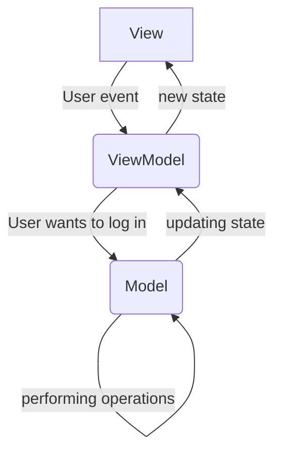
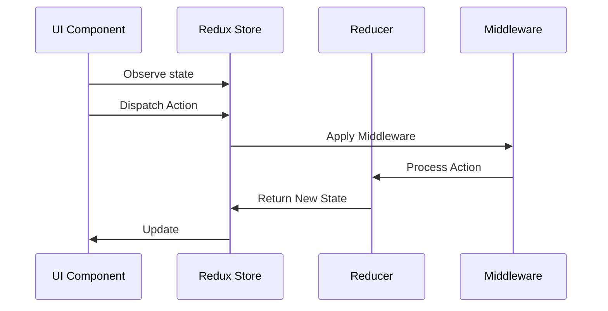

> I have already covered [MVC](https://asvid.github.io/2024-01-27-MVC), [MVP](https://asvid.github.io/2024-01-29-MVP), and [MVVM](https://asvid.github.io/2024-02-09-MVVM). But...

## There is another

Just when you might think that `MVVM` is already sufficient, if not perfect, for the majority of cases, I introduce you to yet another MV-structured architecture. However, there's a twist. This one, known as `Model View Intent`, is more fluid in nature compared to the previously mentioned patterns. In my opinion, it spans a spectrum starting from a basic `MVVM` with event/action communication flow and extending to `Redux` for global app state management, with the inclusion of feature or module-specific local state storage. The boundaries are flexible within this spectrum.

But what exactly is the `Intent` here? Forget about the Android `Intent` class; it is unrelated. In this pattern, "Intent" serves as an abstraction over an event or action. For example, when a user clicks a button, they likely have a certain intention such as "log me in" or "delete my account". Likewise, if your phone discovers a new Bluetooth device, it triggers an event that may lead to an `pair new device` intent.

In essence, the intent typically originates in the `View` (though it can originate elsewhere, such as a background event or push notification), then it is relayed to the `Model` for processing. Subsequently, the state is updated, and the `View` receives the refreshed data for display.



But how is that different from MVVM?

## MV(VM)I

In many `MVVM` implementations, the `View` often calls methods directly on the `ViewModel`, as explained in my [previous post](https://asvid.github.io/2024-02-09-MVVM#ui-events). However, the `View` can also emit events defined by the `ViewModel` through a single contact method, as also detailed in that post. This approach represents a basic introduction to MVI, where `MVVM` uses events for communication from the View to the ViewModel.

It's common to encounter a significant amount of boilerplate code in each `ViewModel`, involving tasks such as managing state, executing coroutines within `viewModelScope`, and so on. This repetitive code can be abstracted and separated, allowing the `ViewModel` to focus on its core responsibilities without being cluttered by mundane tasks. I came across an insightful video that guides you through this process comprehensively, providing a deeper understanding beyond just showcasing the end result:

[How to write your own MVI system and why you shouldn't](https://www.youtube.com/watch?v=E6obYmkkdko)

The title of the video implies that manually creating an MVI system may not be the optimal approach, suggesting the use of available libraries instead. While I agree with this point, as there are indeed libraries that can automate these processes for you, I also believe it is crucial to grasp the underlying mechanics to truly comprehend how it functions.

### The Container

The place where you put all the boring stuff is `Container`, encompassing the `STATE`, and the capability to trigger `SIDE EFFECTS` – events that do not alter the state directly but necessitate some action from the View. In this setup, the `Container` carries out state alterations based on the logic defined in the `ViewModel`, executing within a coroutine scope managed by the `ViewModel`. It's important to note that the `ViewModel` is not a `Container`; instead, it utilizes it. Following the principle of **composition over inheritance**, `ViewModel` leverages the functionality of the `Container`.

The `ViewModel` remains the entity responsible for declaring events, side effects, and the state. This approach restricts their scope, ensuring they are tailored to handle tasks relevant to the specific section of the User Interface. If a more global event occurs, it should not be managed by a particular `ViewModel`; instead, all relevant ViewModels should observe the pertinent changes in the `Model`.

```kotlin
// UI will display this:
data class State(
    val items: List<Int> = emptyList(),
    val inputError: String? = null,
    val currentInput: String? = null,
    val isLoading: Boolean = false
)

// UI will observe those:
sealed class SideEffect {
    class ShowError(val text: String) : SideEffect()
    class ShowToast(val text: String) : SideEffect()
}

// and UI will send those:
sealed class Event {
    data object AddButtonClicked : Event()
    class InputChanged(val input: String) : Event()
    class RemoveItem(val item: Int) : Event()
}
```

The View Model code:

```kotlin
class ViewModel : ViewModel() {

    val container = Container<State, SideEffect>(viewModelScope, State())
    ...
```

Handling UI events with the only public method in ViewModel:

```kotlin
fun handleEvent(event: Event) {
    when (event) {
        Event.AddButtonClicked -> addButtonClicked()
        is Event.InputChanged -> inputChanged(event.input)
        is Event.RemoveItem -> removeItem(event.item)
    }
}
```

If you are thinking about logging user actions, this may be the place to do it.

Events are handled like that:

```kotlin
private fun removeItem(item: Int) = container.intent { // this block implements logic of changing the state
    showLoading() // calling another method that uses container
    Model.removeItem(item)
        .onSuccess { hideLoading() }
        .onFailure { error ->
            hideLoading()
            container.postSideEffect(SideEffect.ShowError(error.message.orEmpty())) // using side effect
        }
}

private suspend fun showLoading() {
    container.reduce { // reduce means take the current STATE, and produce new one from it
        copy(isLoading = true) // actual state changing logic
    }
}

private suspend fun hideLoading() {
    container.reduce {
        copy(isLoading = false)
    }
}
```

The equivalent in more traditional MVVM would be

```kotlin
    private fun hideLoading() {
    viewModelScope.launch {
        _state.update { it.copy(isLoading = false) }
    }
}
```

The refinement may not be drastic, but it streamlines the process by eliminating the necessity to remember to utilize `viewModelScope`, resulting in cleaner and more readable code. The updates to the `STATE` become more apparent, enhancing clarity, especially when managing numerous events.

### Under the hood

The `Container` itself is pretty simple in code:

```kotlin
class Container<STATE, SIDE_EFFECT>(
    private val scope: CoroutineScope,
    initialState: STATE
) {

    private val _state: MutableStateFlow<STATE> = MutableStateFlow(initialState)
    val state: StateFlow<STATE> = _state

    private val _sideEffect = Channel<SIDE_EFFECT>(Channel.BUFFERED)
    val sideEffect: Flow<SIDE_EFFECT> = _sideEffect.receiveAsFlow()


    suspend fun reduce(reducer: STATE.() -> STATE) {
        withContext(SINGLE_THREAD) {
            _state.value = _state.value.reducer()
        }
    }

    fun intent(transform: suspend Container<STATE, SIDE_EFFECT>.() -> Unit) {
        scope.launch(SINGLE_THREAD) { // to make handling intents non-blocking
            this@Container.transform()
        }
    }

    suspend fun postSideEffect(sideEffect: SIDE_EFFECT) {
        _sideEffect.send(sideEffect)
    }

    companion object {
        private val SINGLE_THREAD = newSingleThreadContext("mvi")
    }
}
```

The `Container` encapsulates the ViewModel's coroutine scope and initial state, facilitating the organization of all state-changing logic. It does not execute actual tasks, as that responsibility remains with the ViewModel. The threading logic implemented is basic yet functional, serving its purpose effectively. Generics inheritance from a `BaseState` or `BaseSideEffect` is unnecessary in this setup. The primary role of the `Container` is to streamline the ViewModel boilerplate and enhance the clarity of tasks performed by it. The focus here is on local state management within a single UI component, a single ViewModel, and a collection of events and state properties.

This refined implementation, extending simple MVVM with UI events and abstracting boilerplate, is designed to simplify and enhance readability. Keeping the structure straightforward and avoiding unnecessary complexity will take you a long way, so don't overthink it :)

## Redux

At the other end of the spectrum lies `Redux`, known for its global state management, global actions, reducers, and middleware. I don't want to go too deep into this, because I agree with arguments made in [this video](https://www.youtube.com/watch?v=q7y6NQ_ou0A), that on Android there is no need for such architecture. Unlike presentation architectures like `MVC` or `MVVM`, `Redux` provides a comprehensive framework for the entire application – a feature that can be advantageous but requires careful consideration.

Here are key elements of `Redux`:

1. **Store**: The core of Redux architecture, serving as the central hub that houses the application's state. The store is responsible for:
	- Managing the application state.
	- Providing access to the state.
	- Enabling state modifications.
	- Registering listeners for state changes.
2. **Actions**: Plain objects that represent the intention to change the state. Actions are the only way to send data from the application to the store. Actions can optionally carry additional data.
3. **Reducers**: Pure functions responsible for specifying how the application's state changes in response to actions. A reducer takes the current state and an action as arguments, and returns the new state. Reducers must be pure functions, meaning they must return the same output for the same input, without modifying the input arguments or causing side effects.
4. **Middleware**: Functions that provide a third-party extension point between dispatching an action and the moment it reaches the reducer. Middleware can intercept actions and perform various tasks, such as logging, async operations, or routing.
5. **Selectors**: Functions used to extract specific pieces of data from the Redux store state. Selectors help in keeping the codebase maintainable by encapsulating the logic for extracting data.
6. **Components**: User interface elements that interact with the Redux store by dispatching actions and reading state. Components can subscribe to the Redux store to receive updates when the state changes.

The sequence of actions will look like that:



This approach can be immensely helpful when handling events that do not originate from the UI; for example, scenarios where multiple visible components on the UI need to be updated based on data obtained from a web socket. In this setup, small components observe only the data that is relevant to them and are alerted when changes occur. State modifications occur in a single location, making all reducers that change the state easily accessible. No logic is hidden in just another `helper/handler/manager/service`. All events are consolidated in one place, facilitating the creation of an app-wide state diagram outlining the actions to be taken, the processes involved in each event, and the resulting new state. The `Store` serves as an excellent logging point for the entire flow of actions, providing insights into each step. Additionally, reducers have a clear and singular purpose, promoting best practices and the creation of concise methods and classes.

The concepts of Events, Store, and Reducers are platform-agnostic terms, applicable across various languages and technologies. Implanting this architecture enables the creation of consistent behaviors across native Android, iOS, and Desktop applications that respond similarly to the same interactions. Centralizing interactions and features makes it effortless to track them, contributing to a more organized and maintainable codebase.

### The Catch

The complexity can escalate when dealing with a `global` state in more intricate real-life scenarios. While it may seem straightforward in tutorial projects or blogpost sample apps, the number of events and reducers can quickly become overwhelming as the app grows. Managing a `global` state that encompasses all data utilized by every UI element in the app can pose significant challenges. Although each reducer typically handles a single action, the repercussions of an action can ripple through multiple parts of the state, with various reducers potentially modifying the same fields, leading to overwritten updates based on the sequence of their completion.

When it comes to navigation and managing the back stack, using native Android solutions may not be feasible as the entire UI rendering is contingent upon the `global` state. In this paradigm, transitioning back necessitates a modification in the state, requiring a different approach to conceptualize mobile app development compared to traditional methods.

Introducing `Redux` to an existing application can also present hurdles. While starting a new project from scratch allows for easier integration, retrofitting existing logic into reducers, consolidating distributed data pieces into a `global` state, and reworking navigation and UI rendering based on this architecture can be a formidable task.

These challenges are commonly addressed by `MVI`/`Redux` libraries, emphasizing the importance of leveraging established solutions rather than creating a custom implementation. While I worked on a project that utilized a custom Redux implementation successfully, the uniqueness of the problem it solved facilitated this approach. The app operated with minimal user input, predominantly receiving events from the backend or connected devices. The linear step-by-step user flow with simple UI components and no complex navigation worked seamlessly within the Redux-style solution.

When preparing to write this post I noticed that the articles, videos, conference presentations about `Redux/MVI` **boomed around 2018-2020 and then kinda died**. There was a lot of libraries supporting it,  often leveraging Rx. The advent of coroutines and Jetpack has simplified app development. Developers may have realized that simplicity can be achieved without relying on athird-party libraries or nesting multiple third-party solutions. Because like already mentioned - you don't want to implement MVI/Redux yourself.

## Conclusion
I view `MVI` as a diverse spectrum of architectures, encompassing a range from `MVVM` with predefined events to the global app state management of `Redux`. Within this spectrum, you can find approaches like packaging `MVVM` boilerplate into a `Container`, utilizing a `Store` per `ViewModel`, or adopting a distributed app state model where multiple `ViewModels` share a `Store`.

While a global app state can offer certain advantages, it also introduces challenges such as a steep learning curve for new developers, complexity in state management, and the potential for a high volume of events. Although this type of architecture may be ideal for specific problems, I generally tend to keep things simple, small, and scoped - like `MVVM` with UI events.

This post concludes the series on Android Presentation patterns. Reflecting on this journey, I have gathered several key takeaways:
- Unidirectional data flow simplifies and streamlines the architecture.
	- Events should indicate what happened, not dictate the next action.
- Each component in the system should fulfill a single purpose.
	- Keep things straightforward and scoped.
- Avoid the temptation to over-engineer where simplicity suffices.
	- Complex inheritance structures, excessive generics, and elaborate interface hierarchies may not always be practical.
- Choose the right tool for the task.
	- While a particular tool may seem enticing, it's essential to select the most suitable approach based on the problem at hand.

Remember, not every problem requires a sophisticated solution - sometimes a simple and pragmatic approach is the most effective.