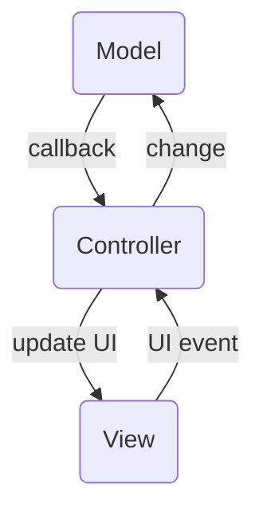
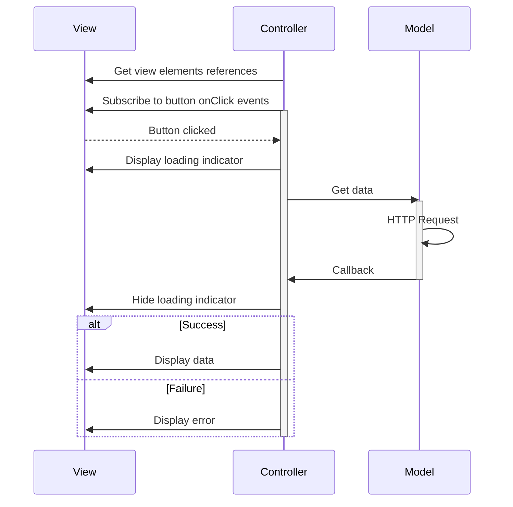

*Disclaimer: You probably shouldn't use MVC in your Android app, there are much better solutions nowadays, that I
mention later in this post.*

## Hello old friend

Model-View-Controller is old indeed, for IT standards at least. Its origins are dating back to the development of
Smalltalk-80 in the 1970s.
You remember book "Design Patterns" by the Gang of 4? Yup, its mentioned there (and the book has examples in Smalltalk).
It was introduced to address the challenges of creating graphical user interfaces. The goal was to decouple the UI
components from application logic.

MVC was one of the early architectural patterns used in Android app development.
Android, influenced by its Java roots, adopted the MVC pattern to structure the code and facilitate the development of
scalable and maintainable applications.

## MVC principles

The most important that goes to all MV-whatever patterns: **The MVC is just the presentation layer, not the whole
app architecture**.

Like the name suggests, there are 3 elements:

- **Model** - it's a bit ambitious in the code, but it's an abstract way of describing business logic,
  interacting with outside world (HTTP requests, BT communication), and internal data (Databases, Cache). Don't
  expect any class in the project to have `Model` in the name. `Model` can be using multiple architectural principles
- **View** - the UI elements. In case of Android applications this will be the XML layout, containing all your buttons,
  text fields, loading indicators etc. but not much logic, or only related to UI itself.
- **Controller** - the main villain of the story. It connects data from `Model` with the interactions from UI. Processing
  user input, updating the `Model`, handling errors, updating UI with new data. Typically, this will be `Fragment` or
  `Activity`.

Using above description, you can guess that ideally the `View` is pretty ~~dumb~~ intellectually challenged, and have 
absolutely no knowledge about
the `Model`. And the other way around, the `Model` don't care about the `View`. So all the heavy lifting is done by the
Controller - and that is kinda the whole point why we have better presentation patterns now.

The diagram with basic interactions may look like this:

## Problems with MVC

MVC provides nice separation of concerns, right? `View` is fairly unaware about anything, the `Model` does its own thing,
and the `Controller` is merging those 2 worlds. And merging is easy, right? Right?

Well it is, but it doesn't scale very good. Take a look on this simple example. There is a `View` with single button,
and some place for displaying data. Also, a simple `Model`, that gets data from the backend. And the `Controller`
handling UI events and getting the data from the `Model`.

That's quite a lot of interactions on the `Controller` side, for such a simple case. And interactions are simplified.
The `Display Data` hides complexity of things like:
- set few text fields to specific values
- update Adapters data and notify it was changed, so the Recycler View will update its contents
- change UI elements visibility or enable/disable some buttons
- change icons
- ...etc

Same goes for `Display error`, where it can be a dialog, a snackbar, input field error... and it's all set manually, 
one by one, by the Controller.

Now imagine there is a form, with multiple buttons, input fields, date-time picker, validating emails, etc. Nothing
unusual in modern applications. Or just pick your phone, open any application, and think how many links between `View`
elements and `Controller` there would be.

From my experience, it often leads to creating countless `Helpers` or `Handlers` that would even get a reference to
the UI element from the `Controller`, just to simplify managing multiple UI components in similar way. There used to
be libraries like [Butterknife](https://github.com/JakeWharton/butterknife) just to help us with boilerplate code of
finding the UI elements, and adding basic event listeners.

Sure, you can split the `View` into smaller pieces, and have multiple controllers, they may even be talking with the
same `Model`. But then you have to make sure they are in sync in some cases. And remember - there is no `State` to
display, the `Controller` is dynamically setting UI elements according to its own logic and `Model` data.

Some typical drawbacks of MVC pattern are:

1. **Tight Coupling Between Components:**
   The controller has direct references to both the model and the view, making it harder to replace or modify
   one without affecting the others. This can lead to code that is less modular and harder to maintain.
2. **Difficulty in Unit Testing:**
   Unit testing can be challenging in traditional MVC, particularly with the Android framework. Since the controller is
   often tightly bound to both the model and the view, isolating and testing individual components becomes more complex.
   This can hinder the adoption of effective testing practices, making it harder to ensure the robustness of the
   codebase. Involving Android framework into tests makes them much slower and more expensive to run.
3. **Massive Controllers:**
   As an Android application grows in complexity, the controllers (activities or fragments) can become large and
   unwieldy. This is often referred to as the "Massive View Controller" problem. Large controllers are harder to
   understand, maintain, and debug, leading to decreased code quality.
4. **Limited Support for Data Binding:**
   Android's original MVC model doesn't inherently support data binding. This lack of native support can result in
   verbose and boilerplate code for updating views when the underlying data changes. More modern architectural patterns,
   such as Model-View-ViewModel (MVVM), address this issue more elegantly with native data binding support.
5. **Complex Lifecycle Management:**
   Managing the lifecycle of Android components (activities and fragments) can become complex in MVC. Developers need to
   manually handle situations such as orientation changes and manage the state of the application across different
   lifecycle events. This complexity can lead to subtle bugs and decrease the overall robustness of the application.
6. **Limited Support for Reactive Programming:**
   MVC traditionally does not integrate well with reactive programming paradigms. Reactive programming, with libraries
   like RxJava or LiveData, has become popular in Android development for handling asynchronous operations and updating
   UI components. Integrating these concepts into the MVC pattern can be less straightforward compared to other
   architectural patterns designed with reactive programming in mind.
7. **Code Duplication:**
   In some cases, developers might find themselves duplicating code related to the presentation logic in both the model
   and the controller. This can happen when similar logic is needed to update both the model and the view, leading to
   redundancy and potential maintenance issues.

## Modern alternatives

OK, so MVC sucks and should not be used in modern Android apps. What other choices you have? Quite a few:

1. **Model-View-Presenter (MVP):**
    - **Overview:** MVP is an evolution of MVC that focuses on improving the testability and separation of concerns. It
      introduces a Presenter, which acts as an intermediary between the `View` and the `Model`. The `View` is passive and
      delegates user input handling to the Presenter, which then updates the `Model` and `View` accordingly. It sounds a
      lot like `Controller`, but the key here is to have a `Contract` interface between `Presenter` and `View`, so
      the interactions can be abstracted, and references less direct.
    - **Advantages:**
        - Improved testability due to a clear separation between responsibilities.
        - Easier to unit test as the Presenter can be tested independently of the Android framework.
        - Reduced coupling between components.
2. **Model-View-ViewModel (MVVM):**
    - **Overview:** MVVM is a more modern architectural pattern that leverages data binding and reactive programming. It
      introduces a ViewModel, responsible for managing and providing data to the `View`. The `View` observes changes in the
      ViewModels `State` and updates automatically. MVVM promotes a more declarative and
      reactive approach to UI updates.
    - **Advantages:**
        - Native support for data binding, reducing boilerplate code for updating views.
        - Improved separation of concerns, with clear roles for the `Model`, `View`, and ViewModel.
        - Better support for reactive programming with libraries like RxJava or LiveData.
        - Native support for Compose views
4. **Redux Architecture:**
    - **Overview:** Originating from web development, Redux is a predictable state container that can be adapted to
      Android development. It introduces a unidirectional data flow and a single source of truth for the application
      state. Libraries like Redux can be used with Android to manage state changes in a consistent and predictable
      manner.
    - **Advantages:**
        - Centralized state management, making it easier to track and debug application state.
        - Predictable data flow, simplifying the understanding of how state changes propagate through the application.

## Conclusion

The `MVC` pattern was important part of early days Android applications. It laid down foundations, on which
modern presentation patterns grown. Today, its drawbacks make it less appealing for contemporary apps. Issues like tight
coupling, testing challenges, and complex UI management led to the emergence of more modern alternatives.

Model-View-Presenter (MVP) and Model-View-ViewModel (MVVM) address these concerns with improved separation of concerns,
enhanced testability.