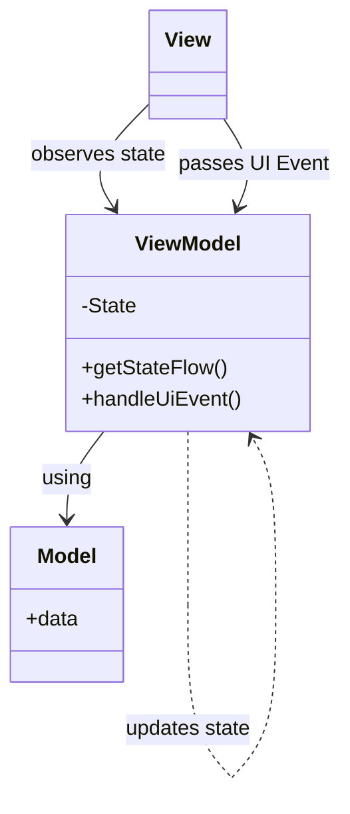

## Evolution

There is a clear trajectory in presentation pattern evolution - decreased coupling. In MVC, components were closely situated, with numerous direct interactions. MVP addressed this by introducing a standard interface structure. It's now possible to test some interactions without relying on UI (although it may sound somewhat peculiar when discussing presentation patterns, I admit). Nevertheless, there are still some challenges, such as maintaining view state or artificial awareness of view lifecycle in MVP. Does the `Model-View-ViewModel` pattern resolve these issues?

## View-View-What?

`Model-View-ViewModel` (MVVM) is a design pattern that originated from Microsoft's WPF (Windows Presentation Foundation) framework and gained popularity in Android development due to its effectiveness in handling UI-related concerns. MVVM emerged as an evolution of the traditional MVC (Model-View-Controller) pattern, tailored specifically for the needs of modern UI development. The roles of Model and View have remained unchanged since `MVP`, or even `MVC`. The most significant practical change in the `ViewModel` approach is actually not explicitly stated in the pattern's name. It's the `State`, and how it's utilized.



### State

That's a very serious name for a fairly simple concept. It's a container for data that a `View` needs to display. `State` will have fields for text input values, booleans controlling button display or not, lists of items to show in UI, etc.

```kotlin
data class State(
    val items: List<Int> = emptyList(),
    val inputError: String? = null,
    val currentInput: String? = null,
    val isLoading: Boolean = false
)
```

How is that different from the `View` itself? Well, a `View` typically doesn't have a single place for all the data that it is using. Data is scattered over multiple fields or arguments, and doesn't create a consistent state. In MVC or MVP, `View` elements are changed independently, so the `Controller` or `Presenter` needs to be aware of how to set up the `View` to represent a particular state.

In MVVM, the philosophy is a bit different.

### ViewModel

Alright, so how does the `ViewModel` manage state? First of all, the `State` is immutable. We don't want multiple places to update it without synchronization.

But how can we modify an immutable state then?

**We don't.**

Instead, we create a new state based on the existing one. Then, we push it to a flow that the `View` observes. You might want to have a private mutable flow so that the `ViewModel` can update the current state freely, and an immutable version of it so that the observer cannot inadvertently modify the flow.

Here's an example:

```kotlin
private val _state: MutableStateFlow<State> = MutableStateFlow(State())
val state: StateFlow<State> = _state
```

To update the `State`, you can take the current version of the state, make necessary changes, and then push it to the flow. Here's an example:

```kotlin
_state.update { currentState ->
    currentState.copy(inputError = exception.message)
}
```
Using a `data class` to model the `State` allows you to use the `.copy()` function easily.

By updating the `State` in this manner, each subsequent update will consider the previous state, helping to prevent race conditions and ensuring that the state is composed of multiple incremental updates.

The `ViewModel` operates independently of the `View`, which is quite beneficial. **Its primary role is to generate new states based on data or events from the `Model`**. The `ViewModel` does not have any reference to the `View` in any manner.

#### Testing

In my opinion, the greatest benefit of using `MVVM` is how incredibly simple it is to test. The `ViewModel` is completely independent of Android or UI specifics; its sole purpose is to respond to UI events and generate new `State`. This isolation makes it a perfect black box :) Most tests will follow this pattern:

1. Set up the system under test (model data, initial state).
2. Trigger a UI event.
3. Verify if the state update meets expectations.

And that's all there is to it.

#### Lifecycle awareness

One challenge with `MVP` was that the `Presenter` often lacked awareness of when the `View` was displayed or destroyed. As a result, it could make unnecessary UI changes when they were no longer required. The typical workaround was to incorporate methods like `attachView` and `detachView` and ensure everything was properly linked.

`ViewModel`, on the other hand, addresses this issue seamlessly with `viewModelScope`. As outlined in the documentation:
> This scope will be canceled when ViewModel will be cleared, i.e ViewModel.onCleared is called.
>
>This method will be called when this ViewModel is no longer used and will be destroyed.
> It is useful when ViewModel observes some data and you need to clear this subscription to prevent a leak of this ViewModel.

Even though the `ViewModel` is independent of the `View`, it will be notified when it is no longer required.

#### Databinding

In the past, during the era of `XML` views, there existed a method called **Databinding**. It enabled the creation of a stream of updates to `View` elements, allowing the *data* from the `Model` to be directly bound to UI elements. This eliminated the need to expose separate methods in the `View` for each element and manually update them whenever changes occurred in the Model. While there were native approaches to achieve this, as well as some Rx libraries, I was never particularly fond of establishing a direct link between the `Model` and the `View` with intermediary tools.

In my opinion, as of 2024, with the advent of Jetpack Compose, there is no longer a need for traditional databinding. Utilizing `StateFlow` with a straightforward `State` object that is consumed by `@Composable` functions to construct the UI is **significantly simpler**. I am uncertain whether databinding is even feasible with Jetpack Compose; perhaps it would involve utilizing multiple data streams, each corresponding to a specific UI element you wish to bind.

In conclusion, I would advise against attempting databinding and instead embrace Jetpack Compose, leveraging a single `State` flow, and immensely enjoying the convenience of the `@Preview` annotation.

### View

In contrast, the `View` maintains a reference to the `ViewModel` because it must observe the `State` and transmit UI events to it.

Upon receiving each new `State` gathered by the `View`, the UI is updated to reflect the current state produced by the `ViewModel`. **The `State` serves as the ultimate source of truth**; the `View` should not retain its own data and then combine it with state changes to determine what should be displayed.

The same principle applies to the logic as well – all operations related to UI handling should be encapsulated within the `ViewModel`, while business logic should reside in the `Model`.

#### UI Events

The `View` is responsible for informing the `ViewModel` about UI interactions. This can be achieved by simply invoking public methods of the `ViewModel`, as the `View` holds a reference to it.
Therefore, the `ViewModel` can expose a method such as:

```kotlin
fun addButtonClicked() {
    viewModelScope.launch {
        // Functionality
    }
}
```

And the `View` will directly call this method:

```kotlin
Button(
    onClick = {
        addButtonClicked()
    },
)
```

However, this approach may not scale well. The `ViewModel` methods could become bloated with repetitive code for managing `viewModelScope`, handling potential errors, and updating state.

A cleaner solution is to have the `ViewModel` manage events through a single public method.

```kotlin
sealed class Event {
    data object AddButtonClicked : Event()
    class InputChanged(val input: String) : Event()
    class RemoveItem(val item: Int) : Event()
}

------
// Inside ViewModel:        
fun handleEvent(event: Event) {
    when (event) {
        Event.AddButtonClicked -> addButtonClicked() // calling private method
        is Event.InputChanged -> inputChanged(event.input)
        is Event.RemoveItem -> removeItem(event.item)
    }
}
```

In general, all UI events should be directed to the `ViewModel` for decision-making and state updates. However, there can be exceptions, and the official decision tree from the [Android Developer website](https://developer.android.com/topic/architecture/ui-layer/events) provides a good illustration of when it might be acceptable to have some logic in the `View`.


Another aspect to consider is whether the `ViewModel` should handle all UI logic or if certain more straightforward tasks can be managed by the `View` itself. When working with `Jetpack Compose`, there might be a temptation to incorporate some logic into `@Composable` functions since they are authored in Kotlin, similar to `ViewModel` code. My approach usually aligns with a decision-making process similar to the one depicted in the mentioned decision tree.

For instance, if the `State` includes a list of items, but the UI only needs to display the number of items, I would leave this calculation in the `View` instead of introducing another `State` field solely to count the elements in the list every time it is updated. Similarly, if the task involves filtering elements within the list without altering the list itself, I would handle it in the `View`. However, for more complex filtering scenarios that require testing it might be better to place the logic in the `ViewModel`. Ultimately, the approach taken depends on the specific situation, but as a general guideline, I strive to centralize most logic in the `ViewModel`, except for trivial UI data that has no impact on the `State`.

#### Side Effects

Not every UI element needs to be displayed by updating the `State`. Temporary UI components like `Snackbar` or `Toast`, which disappear quickly and typically convey information about an event such as an error or success, don't necessarily need to be tied to the `State`. It is important for the `State` to be aware of whether an error was displayed or is no longer present (to prevent duplicate displays, for instance), but these events are often of the **fire-and-forget** nature, requiring no specific action from the user.

These types of events are referred to as `Side Effects` and can be managed as a separate stream observed by the `View`:

```kotlin
sealed class SideEffect {
    class ShowError(val text: String) : SideEffect()
    class ShowToast(val text: String) : SideEffect()
}
---
// inside ViewMode:
private
val _sideEffect = Channel<SIDE_EFFECT>(Channel.BUFFERED)
val sideEffect: Flow<SIDE_EFFECT> = _sideEffect.receiveAsFlow()
---
// inside View:
lifecycleScope.launch {
    lifecycle.repeatOnLifecycle(Lifecycle.State.STARTED) {
        launch {
            viewModel.sideEffect.collect {
                handleSideEffect(it)
            }
        }
    }
}
```
By using `SideEffects`, the `View` gains the flexibility to determine how to display specific events. While a `ShowToast` side effect may be straightforward, handling a `ShowError` event could vary based on factors like the data in the event or the current UI state. It enables the `View` to decide whether to show the error as a Toast message, within a Snackbar, or by highlighting an input error, based on the context. This approach shifts the decision-making from the `ViewModel` to the `View`, simplifying future modifications and enhancing the modularity of the codebase.

For `Side Effects`, I utilized `Channel` instead of `MutableStateFlow`. Given that there is no initial side effect to populate the stream, and there's no need to retain events in the stream for late observers, opting for `Channel` seems more suitable than `StateFlow`.

#### Previews

Utilizing `State` as an input to the `@Composable` function simplifies the process of creating Jetpack Compose previews. When breaking down the `View` into smaller `@Composables`, it is advisable to pass only the necessary data fields from the entire `State`. This helps reduce dependencies on changes and encourages the creation of concise methods that generate UI elements. Moreover, it facilitates previewing the UI in the IDE, enabling the verification of multiple value variants (such as long numbers, extensive text, dark mode, etc.) without needing to build the entire application.

### Unidirectional Dataflow

The term "unidirectional dataflow" frequently arises in discussions about `MVVM`. But what does it mean? It signifies that data moves in a single direction :) While there may be multiple data flows and the Producer may also observe another flow as an Observer, the flow serves as the sole communication interface. The `View` does not expose methods to manipulate its elements; instead, it observes the `State`. Similarly, the `ViewModel` does not reveal its internal methods but instead awaits UI Events to execute operations and update the `State`. There are no callbacks or waiting for responses. The system operates by sending events in one direction and anticipating updates to the `State`.

[For further information, visit the Android Developer Portal](https://developer.android.com/jetpack/compose/architecture)

### Model

Similar to `MVC` and `MVP`, the `Model` in `MVVM` encompasses the business logic tailored to your specific scenario. While the `ViewModel` manages UI-related logic exclusively, any functionality unrelated to the UI should reside within the domain model code.

## Advantages of MVVM

- **Encapsulation**: Each layer in MVVM is responsible for specific aspects of the application's functionality. The model handles data and business logic, the view manages UI components and layout, and the view model orchestrates the interaction between the model and the view. This clear separation makes it easier to understand and maintain the codebase.

- **Modularity**: MVVM encourages modular development, allowing developers to focus on implementing and testing individual components independently. This modularity makes it easier to add new features, fix bugs, and refactor existing code without affecting other parts of the application.

- **Isolation of Concerns**: The separation of concerns in MVVM makes it easier to write unit tests for each component in isolation. Developers can write tests for the view model layer without needing to interact with the view or the model directly, leading to more focused and efficient testing.

- **Mocking and Dependency Injection**: MVVM simplifies the process of mocking dependencies and injecting test doubles into unit tests. View models can be tested with mock data sources or repositories, allowing developers to simulate different scenarios and edge cases easily.

- **Reduced Boilerplate Code**: MVVM reduces the amount of boilerplate code required for UI-related tasks by leveraging features like data binding and Android Architecture Components. This reduction in boilerplate code decreases the cognitive load associated with writing and maintaining tests, making it easier to ensure code quality and reliability.

- **Lifecycle Awareness**: The `ViewModel`, being a Jetpack component, is lifecycle-aware and handles configuration changes and lifecycle events in Android activities and fragments automatically. This streamlines the management of UI state and helps prevent memory leaks.

## Conclusion

Given the numerous advantages that MVVM offers to Android development, it is highly recommended as the default pattern for most scenarios. Its clear separation of concerns facilitates the maintenance of a clean and structured codebase, enhancing readability, extensibility, and debugging capabilities. The improved testability and maintainability provided by MVVM streamline the development process, leading to faster iterations and higher code quality. Additionally, its seamless integration with Android Jetpack components and support for reactive programming paradigms make MVVM ideal for modern Android app development. This empowers developers to create responsive, scalable, and maintainable applications with ease.
